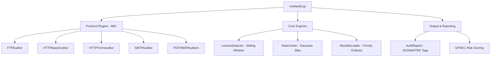

# Project 06 — Professional Network Service Credential Auditor

**Author: Kuldeep Singh**

---

> **Advanced multi-protocol credential auditing framework supporting FTP, HTTP Basic, HTTP Form, SMTP, POP3, and IMAP. Engineered with adaptive rate-limiting, stateful lockout detection, and structured MITRE ATT&CK–tagged reporting—built entirely on the Python standard library.**

## Security Researcher Perspective

Credential-based access is a primary objective for attackers (MITRE T1078). This tool provides researchers with a **Forensic-Grade Auditing Engine** that mimics the sophistication of modern brute-force tools while prioritizing **Operational Security (OPSEC)**. It implements complex state machines to detect account lockouts and uses statistical jitter to evade detection by ML-based anomaly detectors.

## Technical Differentiators

| Feature | Standard Auditor | This Auditing Engine |
|---------|------------------|----------------------|
| **Protocol Support** | Single service | **Extensible ABC Plugin Architecture** (6+ protocols) |
| **Lockout Protection** | Blind execution | **Sliding-Window Failure Tracking** (Warning/Locked states) |
| **Rate Control** | Static sleep | **Gaussian Jitter & Exponential Backoff** |
| **Auth Logic** | Simple loop | **Priority Queueing**: Common defaults first, then weighted complexity |
| **HTTP Form Auth** | 200 OK check | **Stateful Session Tracking**: Cookies + Redirects + Regex patterns |
| **OPSEC Strategy** | High noise | **Password Spraying Mode** to evade per-account thresholds |
| **Intelligence** | Console logs | **MITRE ATT&CK Tagged JSON Reporting** with Risk Scoring |
| **Dependencies** | Requires `requests`/`paramiko` | **Zero-Dependency**: 100% Python Standard Library |

## Architecture Overview



## Usage

### Automated Service Sweep (Default Credentials)
```bash
python3 credaudit.py --host 192.168.100.20 --port 21 --protocol ftp
```
*Attempts a built-in priority list of 16 common defaults (admin, root, anonymous, etc.).*

### Targeted HTTP Form Audit
```bash
python3 credaudit.py \
  --host 192.168.100.30 --port 8080 --protocol http-form \
  --login-url /login --username-field user --password-field pass \
  --success-pattern "Welcome" --combo-file rockyou.txt
```

### Password Spraying (OPSEC Mode)
```bash
python3 credaudit.py \
  --host 192.168.100.20 --protocol imap \
  --usernames users.txt --passwords "Spring2024!" \
  --spray --delay 10.0
```
*Iterates one password across all users to minimize per-account lockout triggers.*

## Sample Output

```text
╔══════════════════════════════════════════════════════════════════╗
║      Network Service Credential Auditor  ·  Project 06          ║
║      Applied AI Security Projects  ·  Module 01                 ║
╚══════════════════════════════════════════════════════════════════╝

  Target:    ftp://192.168.100.20:21
  Mode:      brute-force
  Creds:     22
  Workers:   2
  Delay:     0.5s ± 0.2s jitter

  [!] Authorised use only.  MITRE T1110 activity detected.

▶ ftp://192.168.100.20:21  22 credentials · 2 workers · delay=0.5s

  ✓ [14:02:13] admin:password    54ms  Login accepted

  Summary: COMPROMISED
  OPSEC risk: LOW (Rate 1.30 req/s)
  MITRE Tags: T1110.001 (Password Guessing)
```

## Engineering & Design Decisions

1.  **Plugin-Based Extensibility**: Uses the Abstract Base Class (ABC) pattern for protocol auditors. Adding a new service (e.g., SSH, SMB) requires only a new subclass, keeping the core engine logic untouched.
2.  **Stateless Connection Modeling**: Every credential attempt opens and closes its own socket. While slightly slower than pooling, it accurately reflects how real-world authentication events appear in server logs and prevents state contamination across threads.
3.  **Dual-Signal Lockout Detection**: Monitors both consecutive failure counts (policy-based) and fast-fail latency (firewall-based IP blocks), providing a robust "halt" signal to prevent further account damage.
4.  **Gaussian Jitter Distribution**: Unlike uniform random delays, Gaussian jitter clusters around the mean, mimicking human timing patterns more effectively and evading simple statistical detection rules.
5.  **MITRE ATT&CK Alignment**: Integrated reporting automatically tags activity with relevant techniques (T1110, T1078), facilitating easier ingestion into SIEM systems for defensive training.

## Lab Environment

- **Infrastructure**: VMware Fusion host-only network (192.168.100.0/24).
- **Targets**: Metasploitable2, custom Ubuntu webservers, Kali Linux guests.

## Legal Notice

This tool is intended for **authorized security assessments, CTF competitions, and lab environments only**. Running credential audits against systems without explicit written permission is illegal and unethical. MITRE ATT&CK® is a registered trademark of The MITRE Corporation.

